# Flatbox_RGB-OLED—A remix of Flatbox_rev5

- [What's this?](#whats-this)
- [What's new?](#whats-new)
- [What you need?](#what-you-need)

## What's this?

An adaption from [flatbox rev_5](https://github.com/Xchiliarch/flatbox_RGB-OLED/tree/master/hardware-rev5) , added RGB, OLED support and a new button.

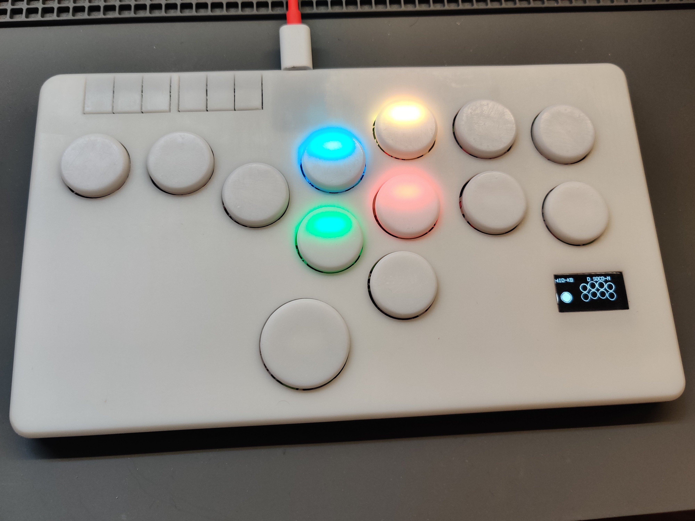

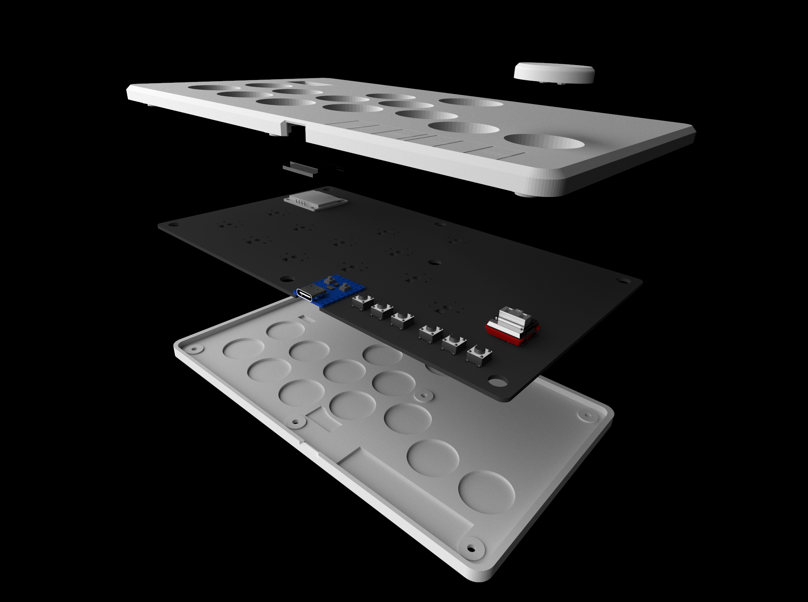

## What's new?
- added RGB&OLED support
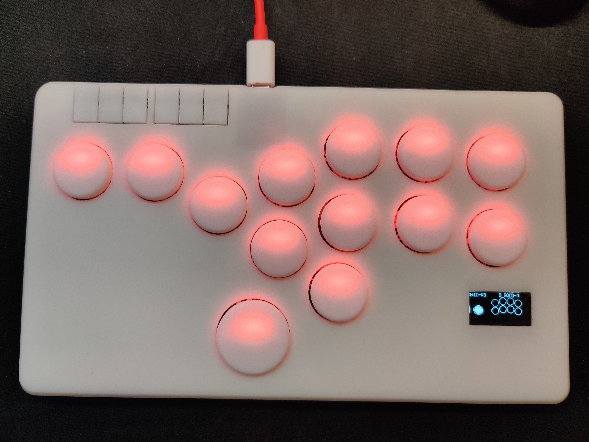
- a new button

- buttons are at same level with the case when pressed down

  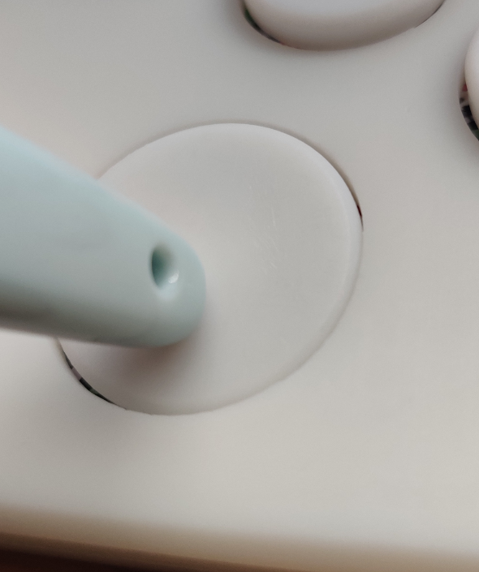

  

## What you need?

| Parts                   |            Name            | Pcs  | Price |
| :---------------------: | :--: | :---: | :---------------------: |
| 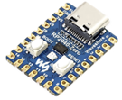 | Waveshare RP2040-ZERO |  1   | ￥19 |
| 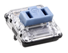 | Kailh Choc V1 Switch | 13 | ￥3.2 ×13 |
| 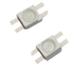 | WS2812B 3528LED | 13 | ￥0.4 ×13 |
| 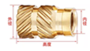 | M3×5×4.2 Heat Set Insert | 7 | ￥0.09×7 |
| 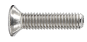 | M3×6 Flat-head Screw |  7   | ￥0.02×7  |
|   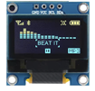   | SSD1306 0.96" OLED Display |  1   |    ￥8    |
|   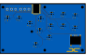   | PCB | 1 | ￥110 for 5Pcs |
| 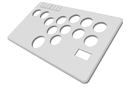 | TOP case | 1 | ￥45* |
| 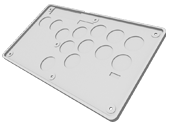 | BOT case | 1 | ￥34* |
|  | LENS(Transparent) | 1 | ￥12** |
| 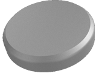 | big Cap | 1 | ￥2 |
| 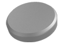 | Small cap | 12 | ￥2×12 |

### Additional Info

All 3D printed case are from  JLC's 3D printing service (Sanweihou) and PCB order from JLC.

*: using  9000R, will be cheaper with X Resin.

**: using 8001+ Surface Finish: Oil Spraying. will be cheaper to sand it yourself.

 

## Credits

This project is made possible with the help of [GP2040-CE](https://github.com/OpenStickCommunity/GP2040-CE) by OpenStickCommunity and [Flatbox](https://github.com/jfedor2/flatbox) by jfedor2.