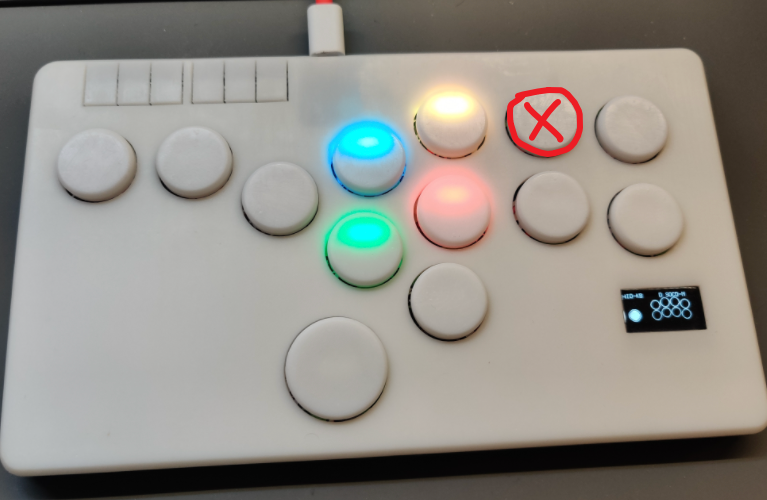
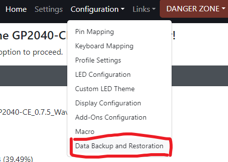
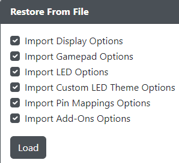

## How to use

- flash flash_nuke.uf2 to device to ensure a clean environment for installation
- flash GP2040-CE_0.7.5_WaveshareZero.uf2 and wait for auto disconnect and reconnection
- disconnect the device and hold the second last button on the upper row and connect to computer

- go to Data Backup and Restoration menu and load config.gp2040

  

  

- done!