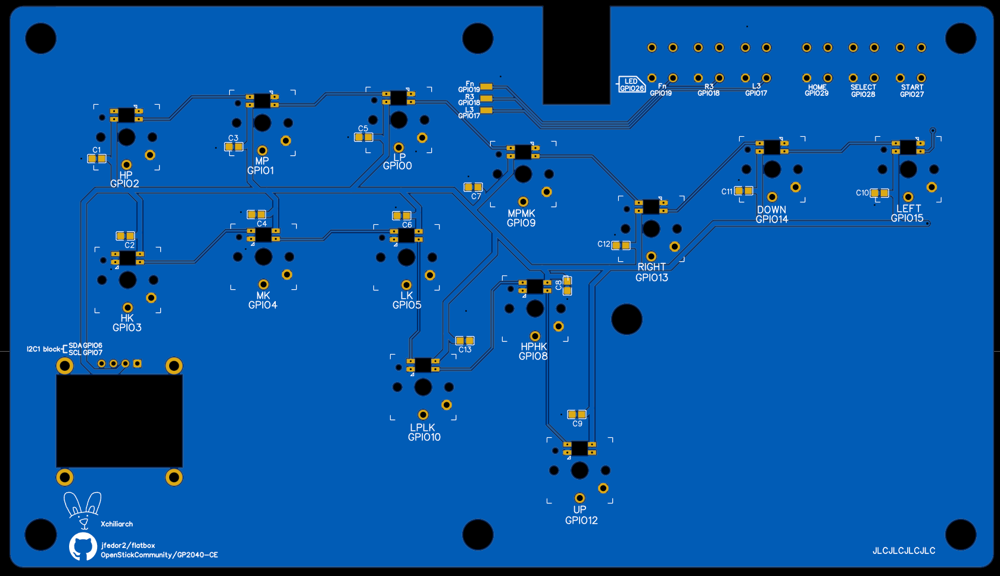
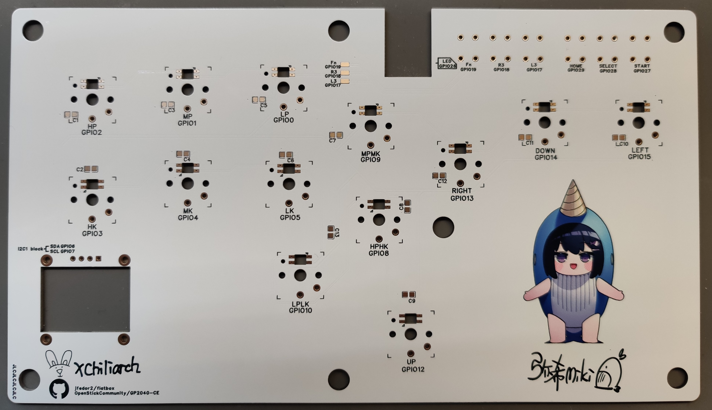

## How to build

To make one you will need:

- 3D printed case TOP, BOT and LENS(transparent)
- PCB **thickness 1.6mm**
- 1x Waveshare RP2040-Zero
- 13x Kailh low profile (**choc v1**) switches
- 3D printed buttoncaps : **12x ButtoncapSmall** and **1x ButtoncapBig**
- 7x Heat-Set Inserts M3x5x4.2
- 7x M3x6 flat-end screws
- 6x 6x6x5  tact switches
- 13x WS2812B LED(3528)
- 13x 0805 100NF capacitor
- 1x SSD106 0.96" OLED Display (PIN SEQUENCE **MUST BE GND VSS SCL SDA**)

### NOTICE

- The three control buttons on the right (Fn,R3,L3)needed to be soldered with fly wires onto the back of the RP2040-ZERO. You can ignore the three buttons and still work well with only HOME SELECT and START, but it is better to solder the buttons on to the PCB in order to protect the vulnerable buttoncap on the top case.

- You need to cut off OLED pins that stretch out after being soldered on to the PCB to make it fit into the case. You may want to sand the pins as well.

  

 

PCB design licensed under [CC BY-SA 4.0](https://creativecommons.org/licenses/by-sa/4.0/).

PCB designed with JLC EDA.